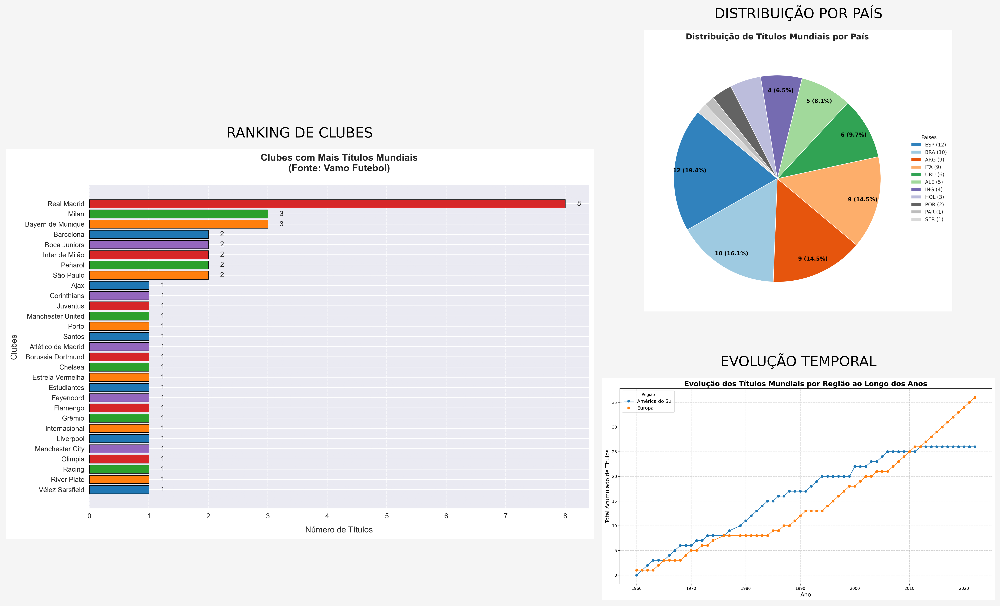
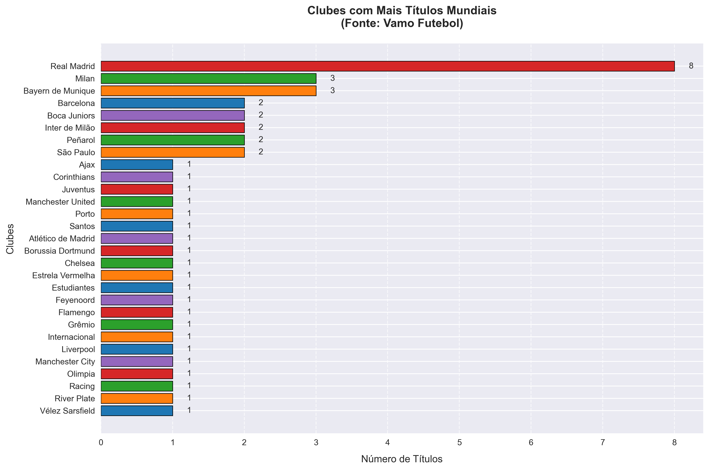
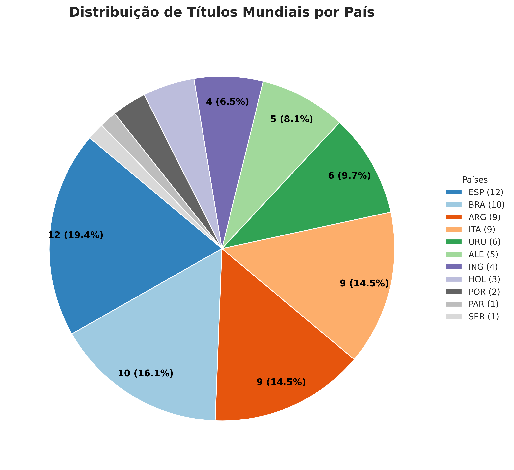
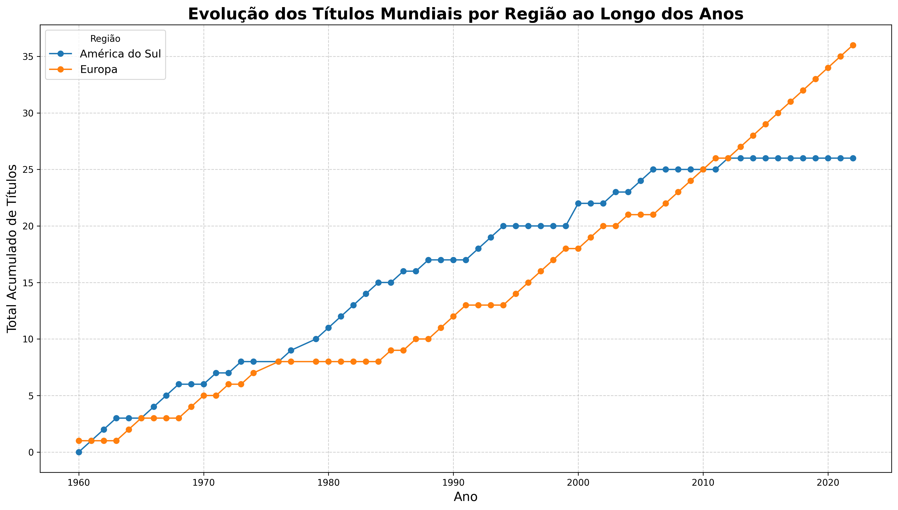

# Análise Histórica de Títulos Mundiais de Clubes de Futebol



Projeto completo de análise de dados que utiliza web scraping para coletar informações sobre títulos mundiais de clubes de futebol, gerando três visualizações profissionais e um dashboard integrado.

## 📊 Visualizações Geradas

### 1. Ranking de Clubes Campeões

- Visualização horizontal dos clubes com mais títulos
- Código personalizado de cores e estilo
- Destaque para valores absolutos em cada barra

### 2. Distribuição por País

- Análise percentual da distribuição de títulos por nacionalidade
- Legendas inteligentes que mostram valores absolutos e percentuais
- Estilo profissional com bordas destacadas

### 3. Evolução Histórica por Região

- Progressão acumulada de conquistas desde o início dos torneios
- Comparativo entre Europa e América do Sul
- Marcadores temporais e grid de referência

### 🖥️ Dashboard Integrado

- Composição profissional dos 3 gráficos em um único painel
- Layout otimizado para melhor visualização
- Elementos decorativos e informativos adicionais
- Exportação em alta resolução (300dpi)

## 🛠 Stack Tecnológica Completa

- **Linguagem**: Python 3.10+
- **Web Scraping**: BeautifulSoup + Requests
- **Processamento**: Pandas + NumPy
- **Visualização**: Matplotlib + Seaborn
- **Dashboard**: Composição automatizada com GridSpec
- **Regex**: Processamento avançado de strings
- **Gerenciamento**: Pip + Virtualenv

## 📋 Requisitos do Sistema

- Python 3.10+
- Pip 22.3+
- 5MB+ de espaço em disco (para gráficos e dados)
- Conexão à internet para coleta inicial
- Resolução mínima 1280x720 para visualização ideal do dashboard

## 🔧 Instalação Completa

```bash
git clone https://github.com/adsu13/projeto-visualiza--o-da-informacao.git
pip install -r requirements.txt